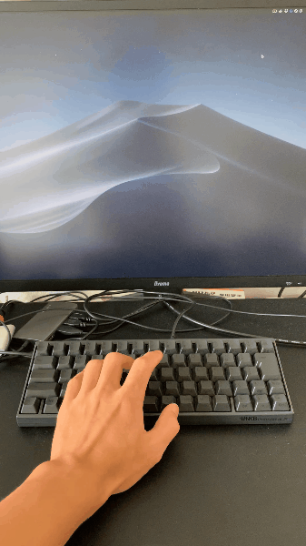
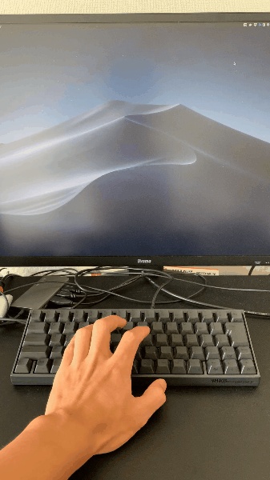

# JustDoItKeyboard

You can just do it when you just type it.




## Environment

- Developed on Python 3.6.7, Mac

## How to install

1. `git clone git@github.com:keix1/JustDoItKeyboard.git`
2. `cd JustDoItKeyboard`
3. `pip install -r requirements.txt`
4. `sudo python scan_keyboard_ShiaLabeouf.py`
5. Enjoy!

## Character Choice

- You can choice two character(Shia Labeouf or Kujo Jotaro)
- If you want to try JOJO, just do it:
    - `sudo python scan_keyboard_Jotaro.py`

## Daily use (alias)

```
alias ora="cd /Users/keiichi/develop/JustDoItKeyboard;sudo python scan_keyboard_Jotaro.py"
alias shia="cd /Users/keiichi/develop/JustDoItKeyboard;sudo python scan_keyboard_ShiaLabeouf.py"
```

